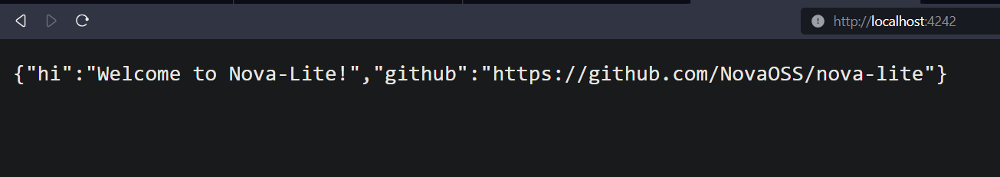

# `nova-lite` - learn how our API works!
✨ The Nova API infrastructure, simplified and made with focus on self-hosting and ease of use for developers!

- Trivial to self-host
- Tons of detailed comments
- Easier to understand, less complex infrastructure
- CORS and Rate Limiting built-in

## Get started

### Setup

#### Requirements

- Python 3.8 or higher
- having `pip` installated
- some knowledge of Python

Create the folder `lite/secrets` and a file in there called `closed.txt`.
Put your OpenAI API keys in there, one per line.

Don't have an OpenAI API key? Implementing OpenAI reverse proxies is very trivial, too. Simply change the `ENDPOINT` constant in `lite/providers/closed.py` file to the API endpoint of the reverse proxy you want to use. Don't forget to also put your API key(s) in the `closed.txt` file.

If you have the permission from the site owner, feel free to reverse a website and modify `lite/handler.py` so that it can be used as a provider.

### Installation

One-liner to get started (run this in the root of the repository, where this README is located):

```bash
pip install --upgrade -r requirements.txt && cd lite && python -m uvicorn app:app --reload --host 0.0.0.0 --port 4242
```

***

Install the dependencies.
```bash
pip install -r requirements.txt
```

Go to the directory where the API is located.
```bash
cd lite
```

Run the server.
```bash
python -m uvicorn app:app --reload --host 0.0.0.0 --port 4242
```

Open in your browser:
[http://localhost:4242](http://localhost:4242)

What you should see:


## Usage

You can test your API in most front-ends like [bettergpt.chat](https://bettergpt.chat) by setting "API Endpoint" to `http://localhost:4242/v1/chat/completions` in the settings.


## Now it's your turn!

This project is also meant to be a learning resource for developers or anyone interested in how the Nova API works.

What you can implement:

- **Key system:** currently, no API key is required. Implement a key system so that only people with a key can use the API
- **Load balancing:** currently, the API only uses a single provider. Implement load balancing so that the API chooses a random provider.
